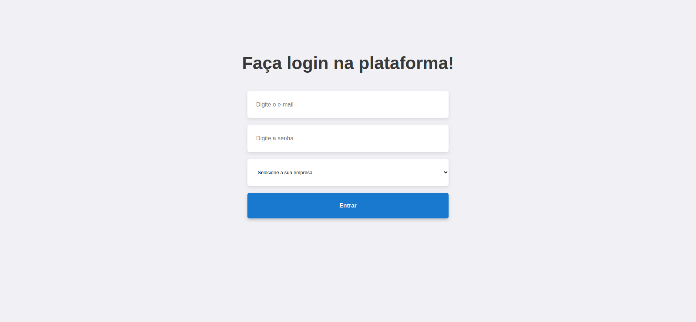
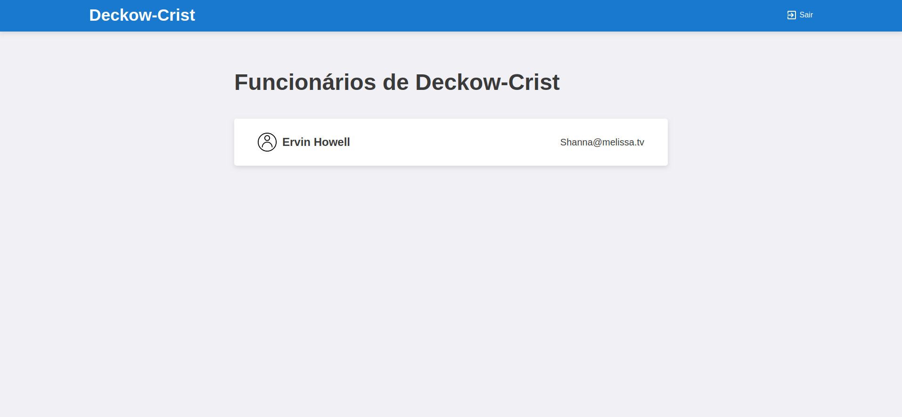
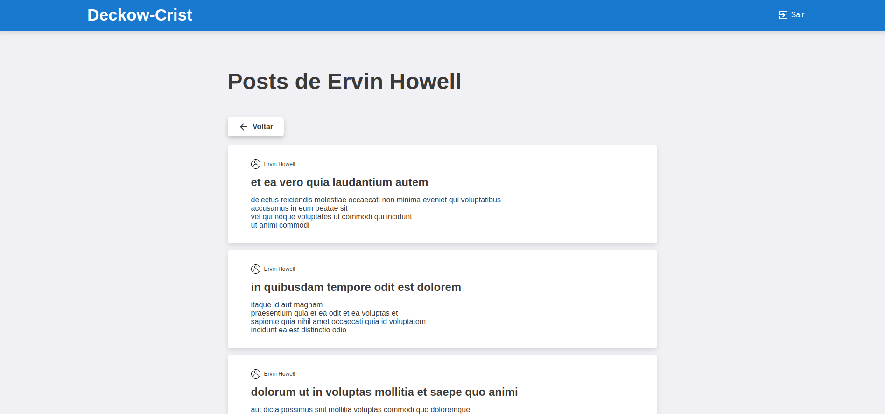

<h1 align="center">
    
</h1>

<h1 align="center">
    
</h1>

<h1 align="center">
    
</h1>

<h2>:rocket: Tecnologias utilizadas</h2>
<ul>
  <li>React.js</li>
  <li>Typescript</li>
  <li>Hooks</li>
  <li>Context API</li>
  <li>Toastify</li>
  <li>Axios</li>
  <li>React Router DOM</li>
  <li>Styled Components</li>
  <li>ESLint + Prettier + EditorConfig</li>
</ul>

<h2>💻 Projeto</h2>

Uma aplicação React para visualizar post de usuários de determinada empresa.

<h2>:question: Instruções para testar o projeto</h2>

Depois de seguir as intruções do [backend](https://github.com/henriSandovalSilva/node-user-posts).

Configure o arquivo .env.example e depois execute:

`cp .env.example .env`

`yarn` 

`yarn build`

 
É necessário colocar os arquivos no build em alguma hospedagem.  
Coloquei o projeto na <b>Netlify</b> em: [http://usersposts.tech/](http://usersposts.tech/)    

Para testar o projeto localmente:

`yarn start`

O projeto irá executar em: [http://localhost:3000](http://localhost:3000)

## :memo: Licença

Esse projeto está sob a licença MIT. Veja o arquivo [LICENSE](LICENSE.md) para mais detalhes.
